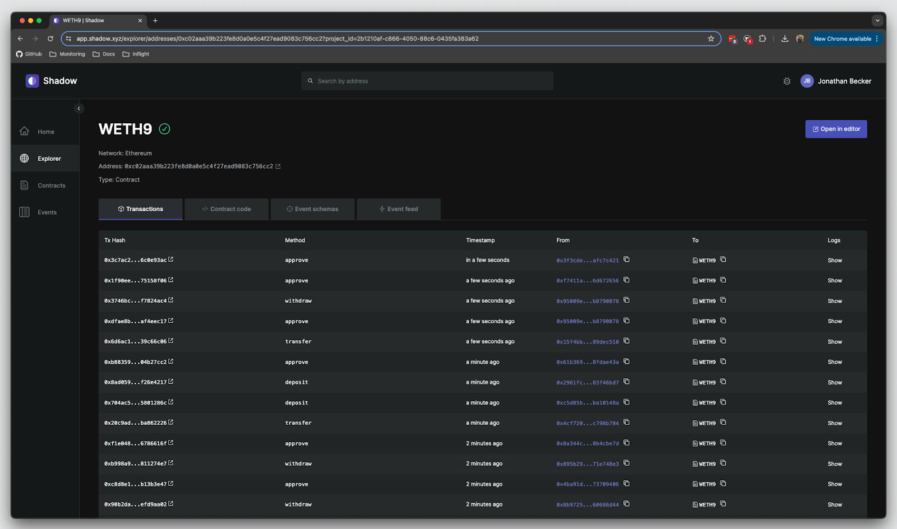
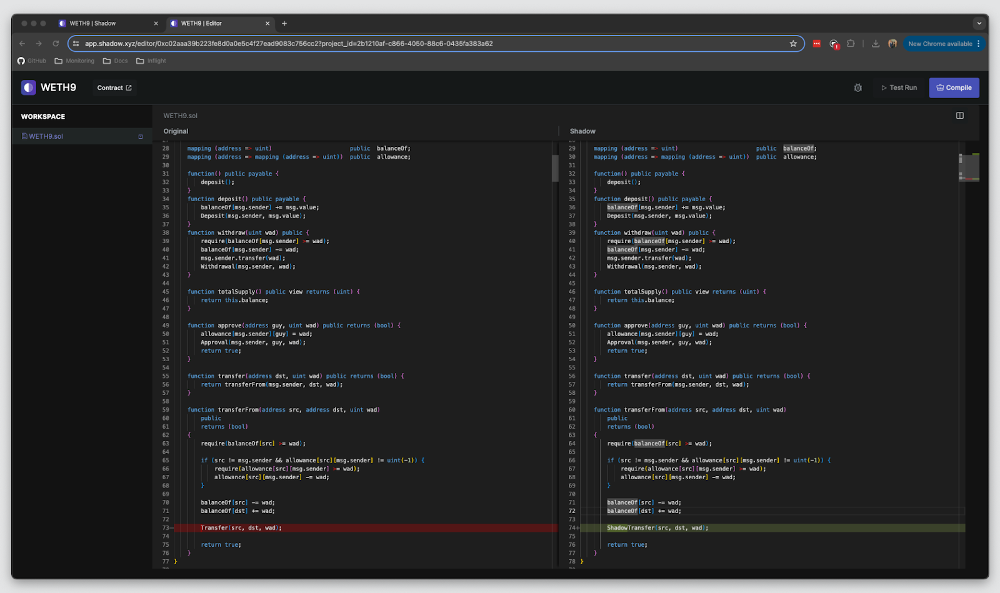
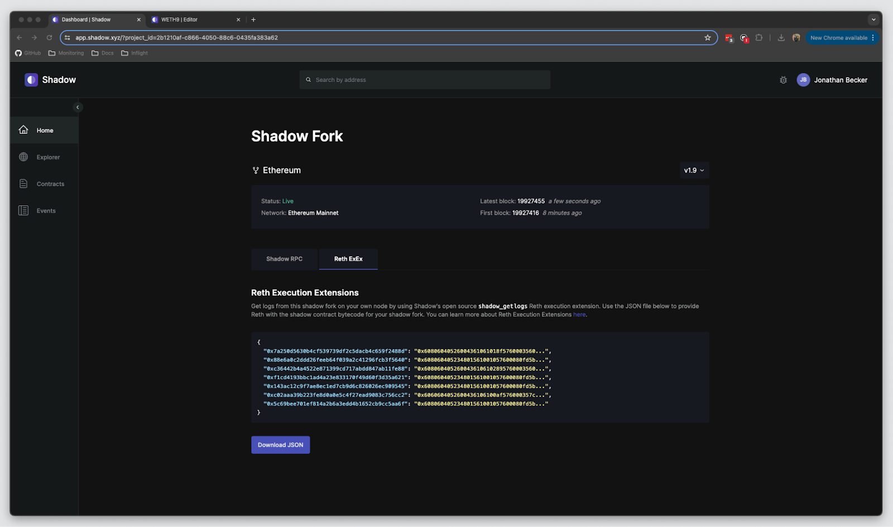

# shadow-reth

A single-node implementation of a Shadow RPC on top of Reth.

`shadow-reth` contains a series of [Reth](https://github.com/paradigmxyz/reth) modifications that enable you to generate shadow events via [Execution Extensions](https://www.paradigm.xyz/2024/05/reth-exex), and retrieve them easily with a custom RPC Extension.

See our [blog post](https://blog.shadow.xyz/shadow-reth/) for more information.

## Getting Started

You can get started with running `shadow-reth` in four steps:

1. Clone this repository
2. Generate a shadow node configuration using any external tool
3. Build and install the `shadow-reth` binary
4. Fetch shadow events via the `shadow_getLogs` JSON-RPC endpoint

### Step 1: Clone this repository

```bash
git clone https://github.com/shadow-hq/shadow-reth
cd shadow-reth
```

### Step 2: Configure your shadow node

To quickly get started, you can use the example `shadow.json` file in this repository. It contains recompiled bytecode for the WETH contract with an added `ShadowTransfer` event.

```bash
cp shadow.json.example shadow.json
```

Otherwise, see the Shadow Configuration section below for detailed instructions on how to configure your shadow node.

### Step 3: Build and install `shadow-reth`

```bash
cargo install --locked --path bin/shadow-reth --bin shadow-reth

# start your shadow-reth node
shadow-reth node [RETH OPTIONS]
```

### Step 4: Fetch shadow events via `shadow_getLogs`

```bash
curl http://127.0.0.1:8545 \
-X POST \
-H "Content-Type: application/json" \
--data '{"method":"shadow_getLogs","params":[{"address": "0xc02aaa39b223fe8d0a0e5c4f27ead9083c756cc2"}],"id":1,"jsonrpc":"2.0"}' \
| json_pp
```

## Shadow Configuration

### With Shadow

1.  Navigate to https://app.shadow.xyz
2.  Search for the contract you wish to modify using the search bar at the top of the webpage.

    <details>
    <summary>View Screenshot</summary>
        
    </details>

3.  Open the contract in the editor and make your changes. When you’re satisfied with your shadow contract, use the compile button, and then the deploy button.

    <details>
    <summary>View Screenshots</summary>
        
        
    </details>

4.  On the home screen, click on the “Reth ExEx” tab, then click “Download JSON”.

    <details>
    <summary>View Screenshots</summary>
        
    </details>

### With Foundry

1. Clone the contract source from a verified contract on Etherscan.

```bash
forge clone 0xC02aaA39b223FE8D0A0e5C4F27eAD9083C756Cc2
```

2. Modify the cloned source code
3. Compile your modified contract, and copy the deployed bytecode from the compiler output:

```bash
# compile your changes
forge build

# get the deployed bytecode
CONTRACT_SRC_FILE=Contract.sol
CONTRACT_NAME=WETH9
grep '"deployedBytecode":' out/$CONTRACT_SRC_FILE/$CONTRACT_NAME.json | sed -n 's/.*"object": *"\([^"]*\)".*/\1/p'
```

4. Add the contract address and shadow bytecode to `shadow.json`:

```json
{
  "0xc02aaa39b223fe8d0a0e5c4f27ead9083c756cc2": "0x60606040..."
}
```

### How does it work?

Here's how it works at a high level:

1. Generate shadow bytecode using any external tool, such as [foundry](https://github.com/foundry-rs/foundry). This bytecode is then added to `shadow.json`, which simply maps contract addresses to their shadow bytecode.

   For example, if you wanted to shadow [Wrapped Ether](https://etherscan.io/address/0xc02aaa39b223fe8d0a0e5c4f27ead9083c756cc2), you would add the following to `shadow.json`:

   ```json
   {
     "0xc02aaa39b223fe8d0a0e5c4f27ead9083c756cc2": "0x60606040..."
   }
   ```

2. Run `shadow-reth`, exactly like you would start and run a normal [Reth](https://github.com/paradigmxyz/reth) node. When a block is committed to the chain, an `ExExNotification` is emitted and handled by [ShadowExEx](./crates/exex), which re-executes each transaction in the block, using a `ShadowDatabase` (which implements `revm::Database`), with the shadow bytecode injected as defined in `shadow.json`. In addition to this, the `base_fee_per_gas` is set to 0, allowing shadow contracts to perform arbitrary computations without worrying about gas costs. Events emitted by shadow contracts are then stored in a sqlite database in revm's `datadir`.

   > Note: All log index fields (`block_log_index`, `transaction_log_index`) _will include_ shadow events. As a result, shadow events will be interleaved with canonical events in the same block, and log indices _will not_ match the canonical chain.

3. A namespaced `shadow` JSON-RPC (see [ShadowRpc](./crates/rpc) is exposed, which allows you to interact with your shadowed contracts. Currently, only `shadow_getLogs` is implemented, which allows you to retrieve Shadow Events emitted by your shadow contracts.

   > Note: for this example, we've added a simple `ShadowTransfer(address,address,uint256)` event to the Wrapped Ether shadow bytecode. This event has the signature `0xe7742d659c2c3c18fba9c357096ed6d568223cb89064e8bc947b709cba2a6ab7`.

   ```bash
   curl http://127.0.0.1:8545 \
   -X POST \
   -H "Content-Type: application/json" \
   --data '{"method":"shadow_getLogs","params":[{"address": "0xc02aaa39b223fe8d0a0e5c4f27ead9083c756cc2"}],"id":1,"jsonrpc":"2.0"}' \
   | json_pp
   ```

   <details>
   <summary>Expand response</summary>

   ```json
   {
       "jsonrpc": "2.0",
       "result": [
           {
               "address" : "0xc02aaa39b223fe8d0a0e5c4f27ead9083c756cc2",
               "blockHash" : "0xe54e22affd13be3e77449a5af5c29d2aee11ffb4f3da44845544f4d55de24e8c",
               "blockNumber" : "00000000012fd986",
               "data" : "0x000000000000000000000000000000000000000000000000052a871b93874afb",
               "logIndex" : "1",
               "removed" : false,
               "topics" : [
                   "0xddf252ad1be2c89b69c2b068fc378daa952ba7f163c4a11628f55a4df523b3ef",
                   "0x000000000000000000000000961ec3bb28c9e98a040c4bded38917aa96b791be",
                   "0x0000000000000000000000003fc91a3afd70395cd496c647d5a6cc9d4b2b7fad",
                   null
               ],
               "transactionHash" : "0xa92037f3e25559e6ccdfdd8695286be525eb7d36f194176a4d577e6ef4409545",
               "transactionIndex" : "123"
           },
           {
               "address" : "0xc02aaa39b223fe8d0a0e5c4f27ead9083c756cc2",
               "blockHash" : "0xe54e22affd13be3e77449a5af5c29d2aee11ffb4f3da44845544f4d55de24e8c",
               "blockNumber" : "00000000012fd986",
               "data" : "0x000000000000000000000000000000000000000000000000052a871b93874afb",
               "logIndex" : "2",
               "removed" : false,
               "topics" : [
                   "0xe7742d659c2c3c18fba9c357096ed6d568223cb89064e8bc947b709cba2a6ab7",
                   "0x000000000000000000000000961ec3bb28c9e98a040c4bded38917aa96b791be",
                   "0x0000000000000000000000003fc91a3afd70395cd496c647d5a6cc9d4b2b7fad",
                   null
               ],
               "transactionHash" : "0xa92037f3e25559e6ccdfdd8695286be525eb7d36f194176a4d577e6ef4409545",
               "transactionIndex" : "123"
           },
           ...
       ]
   }
   ```

   </details>

As a result, `shadow-reth` allows you to run a trustless, fully open-source version of a shadow node.

## Limitations

- <b>Gas limits:</b> `shadow-reth` does not override gas limits when re-executing a block with `ShadowExecutor` for data consistency reasons. Transactions may fail if they run out of gas during shadow re-execution, and no shadow events will be emitted for that transaction.
- <b>Backfilling:</b> `shadow-reth` does not backfill shadow events. If you start running `shadow-reth` on a synced Reth node, `shadow-ret` will only generate shadow events for blocks that have been processed since `shadow-reth` was started. If you want historical shadow events, you’ll need to re-sync your Reth node from genesis. We’re working closely with the Reth team to improve this.
- <b>Decoding:</b> `shadow-reth` is designed to be analogous to a regular node, which doesn’t include event decoding. If you want to decode shadow events, we recommend polling the `shadow_getLogs` endpoint in a separate process.
- <b>Websockets:</b> Shadow events will not be published over `eth_subscribe` websocket subscriptions.

## Getting Help

If you have any questions, first see if the answer to your question can be found in the [reth book](https://paradigmxyz.github.io/reth/)

If the answer is not there and is specific to `shadow-reth`, you can:

- Join the [Telegram](https://t.me/shadow_devs) to get help, or
- Open an issue with the [bug](https://github.com/shadow-hq/shadow-reth/issues/new?assignees=&template=bug.yml)

## Contributing

See our [contributing guidelines](./CONTRIBUTING.md).

## Security

This code has not been audited, and should not be used in any production systems.

## Acknowledgements

`shadow-reth` wouldn't be possible without the hard work of the following projects:

- [Reth](https://github.com/paradigmxyz/reth): The foundation of `shadow-reth`, an Ethereum full node implementation that is focused on being user-friendly, highly modular, as well as being fast and efficient.
- [Revm](https://github.com/bluealloy/revm): Revm is an EVM written in Rust that is focused on speed and simplicity. Revm is the backbone of `shadow-reth`’s `ShadowExecutor`, as well as Reth itself.
